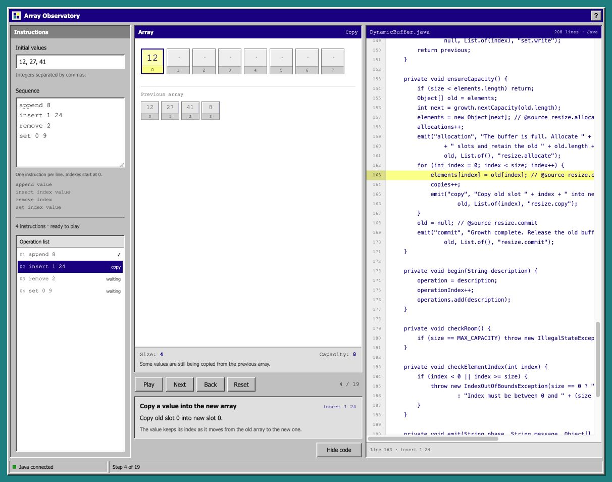

# Array Observatory

A small Java application that lets you see what a dynamic array does: allocate space, copy values, shift elements, and commit an edit. The browser displays snapshots produced by the Java engine. It does not reimplement the algorithm in JavaScript.



## Run

Install a JDK supporting Java 17 or later, then run from this folder:

```sh
./test.sh
./run.sh
```

Open <http://127.0.0.1:4196>. Stop the server with Ctrl+C. The application uses the JDK's local HTTP server and has no downloaded Java dependencies. It binds to the loopback address for local use.

## Explore

- Edit **Initial values** and the **Sequence** of instructions.
- **Play** prepares the sequence in Java and advances automatically; press **Pause** to stop.
- **Next** prepares edited inputs when needed and advances one step. **Back** returns one step.
- **Reset** returns to the initial state while keeping your inputs.
- **Show code** opens `DynamicBuffer.java` beside the array and highlights the line behind each step.

Editing either input stops playback and clears the previous trace. Press Play or Next to use the new sequence. The operation list and description stay visible in one workspace; About explains the project.

Try starting with `12,27,41`, then append two values. The first append fits. The second needs a larger backing array. Insert into the middle to see a different cost: shifting existing elements.

## Model and measurements

The backing array starts with four slots and doubles only when needed. It does not shrink. Size is the number of logical elements; capacity is the number of allocated slots. Unused slots appear as empty cells. During resizing, both the previous array and the partially populated replacement can be visible. The Java engine also supports balanced growth (about 50%) through the API and tests; the simple interface uses doubling.

The API trace includes counters for work performed after the initial values are loaded. They are available for source exploration and are omitted from the simple interface:

| Counter | What it counts |
| --- | --- |
| Writes | New or replacement values from append, insert, and set |
| Copies | Values copied to a replacement array during growth |
| Shifts | Values moved within the current array for insertion or removal |
| Allocations | Replacement arrays created during growth |

Clearing a vacated cell is shown in the trace but is not included in the value-write counter. A frame can show a mutation in progress; size changes when the operation commits. These counts are algorithm instrumentation, not CPU instructions, memory bytes, wall-clock benchmarks, or a JVM heap inspection.

For the underlying array algorithm without tracing, appending is amortized O(1) with geometric growth, but an append that resizes is O(n). Inserting or removing near the front shifts O(n) elements. Indexed access and replacement are O(1).

This instrumented implementation copies storage into each trace frame. That makes an otherwise constant-time edit require a linear snapshot, and a long shift or resize can require quadratic trace storage and time. The counters isolate array operations; they do not measure this extra tracing work. This educational application is not intended as a production collection or performance benchmark.

## Architecture

```text
Browser controls
  -> POST /api/trace (initial values, operations, growth policy)
  -> Java validation and generic dynamic buffer
  -> immutable snapshots of real operations
  -> JSON response
  -> array view, step description, operation list, and optional Java source pane
```

Each request is a separate scenario. No account, database, telemetry, or persistent student data is required. The server exposes only the frontend and an allowlist of this project's Java source files. Inputs are bounded to keep traces small.

## Checks

`./test.sh` runs the dependency-free Java checks, including deterministic randomized comparisons against the standard library and checks of growth, edge cases, counters, and immutable trace snapshots. The GitHub workflow runs the same command.

## Project provenance

This is a new, AI-assisted learning and portfolio implementation of general data-structure concepts. It has a new purpose, API, interface, examples, and tests. It is not a reconstruction of a university scoreboard assignment, and does not include assignment specifications, supplied frameworks, school test data, or private coursework.

The repository demonstrates the work present here. It does not establish historical contribution, deployment, customer, or academic claims. A visual redesign alone does not create permission to publish course solutions; course originals belong outside this repository.

## Useful next experiments

1. Predict the next capacity before stepping through an allocation.
2. Explain why inserting at index zero costs more than appending when there is spare capacity.
3. Add an explicit `reserve` operation and test that it preserves logical values.
4. Explore a shrinking policy, including a workload that alternates insertion and removal.
5. Add a side-by-side comparison of identical workloads under the two growth policies.

## License

MIT. See `LICENSE`.
