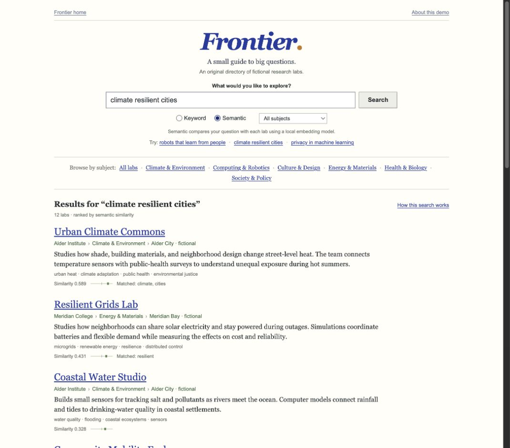

# Frontier

A research-discovery application: describe an idea, compare keyword and semantic retrieval, and inspect how the results reached the page. The interface is a classic web search directory: a search box, blue result links, visible abstracts, and profiles that expand directly below a result. Search explanations and source are optional.

This is a new, AI-assisted learning rebuild. Its twelve labs, institutions, and research descriptions are fictional. It does not recreate private venture code or establish historical customer or institutional claims.



## Run

Requirements: Node.js 22.12+ with npm, Python 3.12–3.13, PostgreSQL with the pgvector extension. On macOS, `brew install postgresql@18 pgvector` provides the database binaries. The shared helper also accepts `PG_BIN` on other systems. Clone the whole `open` repository so the shared `scripts` directory is present.

```sh
cd projects/frontier
./setup.sh
./test.sh
./run.sh
```

Open <http://127.0.0.1:4202>. Setup installs pinned dependencies, seeds the fictional catalog, downloads a local embedding model, and builds Next.js. Initial setup requires internet access; subsequent searches run locally. No paid API key is required.

The default PostgreSQL cluster is isolated in the repository's ignored `.runtime` directory, listens on `127.0.0.1:55432`, and uses a generated password. Its records survive application restarts. `../../scripts/postgres.sh stop` stops this learning database without removing data. No login service is enabled.

You can instead supply `FRONTIER_DATABASE_URL` (or `DATABASE_URL`) for your own PostgreSQL database, including a compatible Supabase database. This path requires pgvector and schema-creation permissions. The local demonstration uses PostgreSQL directly; Supabase cloud authentication, hosting, and deployment are not implemented or claimed tested. Database credentials stay in the Python service.

## Explore

1. Browse the subject directory or result list. Select a lab title to expand its profile directly beneath the abstract; select it again or use Close profile to collapse it.
2. Try a question such as “robots that help people recover movement.” Compare **Keyword** and **Semantic**. Keyword search requires overlapping words; semantic search compares model embeddings with pgvector cosine distance.
3. Choose a discipline to narrow the candidate set. Filters also apply before semantic ranking.
4. Open **How this search works** to replay the actual returned query trace. **Show code** displays the allowlisted source behind a step. This replays an already-completed request; it is not a live debugger.

Similarity is a relative retrieval score, not a probability or evidence that a fictional lab exists. An unrelated question can still have a nearest neighbor. No language model generates answers or fabricates citations. Profiles identify their original fixture as the source.

## Three ways to learn it

- **Build:** read `data/labs.json`, `api/schema.sql`, `api/database.py`, `api/search.py`, `api/main.py`, then `app/page.tsx`. This follows the construction of a complete feature.
- **Follow execution:** use a query and the returned trace to connect the Next.js request, Python validation, model encoding, PostgreSQL ranking, and rendered results.
- **Read source:** use the trace's source view or the files above. The [backend notes](API-README.md) explain the model, exact search behavior, evaluation, and constraints.

Suggested exercise: add an original fictional lab, regenerate its embedding, then add a fixed query to the evaluation file and explain why its ranking changed.

## Architecture and boundaries

Next.js proxies `/api/` to FastAPI on `127.0.0.1:4203`. Python reads PostgreSQL and uses FastEmbed's `sentence-transformers/all-MiniLM-L6-v2` encoder. A separate pgvector table stores 384-dimensional embeddings with model and source hashes; outdated vectors must be regenerated. Keyword mode remains available if semantic assets are missing, and requesting unavailable semantic search returns an explicit error.

This is a single-user local application, with no accounts, ingestion crawler, user-upload processing, or production authorization. Twelve examples and a small evaluation set demonstrate behavior; they do not establish general search quality. The UI exposes errors and empty results, and source access is restricted to an explicit file allowlist.

Reference documentation: [Next.js installation](https://nextjs.org/docs/app/getting-started/installation), [FastEmbed models](https://qdrant.github.io/fastembed/examples/Supported_Models/), and [pgvector](https://github.com/pgvector/pgvector). These references document dependencies; they are not sources validating the fictional catalog.
