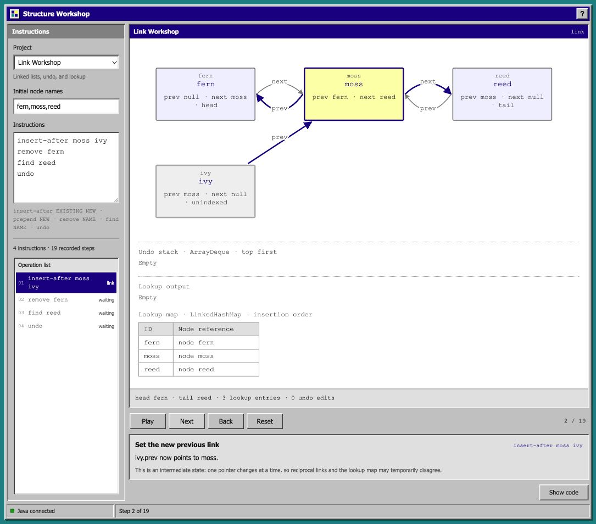

# Structure Workshop

Five small Java experiments in one simple 90s desktop interface. Edit the initial values and instructions, then watch the program change its data structures. **Show code** places the actual Java source beside the visualization and highlights the line associated with the current step.



## Run

Clone the **whole `open` repository**. The array lab compiles and reads `../array-observatory/src/observatory/DynamicBuffer.java`; copying only this project directory will not work.

```sh
git clone https://github.com/elgatito3131/open.git
cd open/projects/structure-workshop
./test.sh
./run.sh
```

Requires a JDK supporting Java 17 or later and a POSIX shell. The scripts use `JAVA_HOME` when set, otherwise `java` and `javac` from `PATH`. No downloaded Java dependencies are required.

Open <http://127.0.0.1:4197/?lab=link>. The server listens only on `127.0.0.1`; stop it with Ctrl+C. The original [Array Observatory](../array-observatory/README.md) remains available separately on port 4196.

## Use

Choose a project, edit its **initial values** and **instructions**, and read the resulting **operation list** and step description.

- **Play / Pause:** follow recorded steps automatically.
- **Next / Back:** move one recorded step at a time.
- **Reset:** return to the initial state, keeping your inputs.
- **Show code / Hide code:** open or close the Java source beside the visualization.

Java executes the instructions and creates immutable snapshots. The browser draws those snapshots; it does not implement a second version of the algorithms. Back replays an earlier snapshot, while the Link Workshop's `undo` instruction is a real operation on its edit history. Steps mark selected assignments and algorithm actions, not every JVM instruction. Restart the server after editing Java so the compiled code and displayed source stay together.

## The five labs

The P0–P4 column maps general concepts from a data-structures learning sequence. These are independent labs with new examples and interfaces, not completed versions of the school assignments.

| Concepts | Lab | What the Java implementation does |
| --- | --- | --- |
| P0: generics and references | **Pair Playground** (`?lab=pair`) | `Pair<T>` stores two typed references. Watch replacements, empty values, and a swap's temporary reference. The browser uses integers; Java tests also use strings. Generic type checking happens at compile time, separately from input parsing. |
| P1: dynamic arrays | **Array Observatory** (`?lab=array`) | Reuses the sibling project's custom `DynamicBuffer`, with doubling growth, indexed edits, copies, and shifts. |
| P2: linked lists, stacks, maps | **Link Workshop** (`?lab=link`) | Custom doubly linked nodes expose each pointer change. Java's `LinkedHashMap` provides name lookup; `ArrayDeque` provides the undo stack. Their internal implementations are not visualized. |
| P3: trees and hashing | **Branch Explorer** (`?lab=branch`) | A custom first-child / next-sibling tree has a fixed 32-slot linear-probing index. See collisions, wraparound, tombstones, preorder, and level-order traversal. |
| P4: graphs and heaps | **Dependency Workshop** (`?lab=dependency`) | A directed adjacency matrix and custom indexed binary min-heap produce a topological order. Heap keys are remaining indegrees, with task names breaking ties. |

## Inputs

Put one instruction on each line. All labs allow at most **24 instructions** per trace.

| Lab | Initial input | Instructions |
| --- | --- | --- |
| Pair | Exactly two signed 32-bit integers, such as `12,27`; `_` means empty | `left 8`, `right 42`, `swap`, `clear left`, `clear right` |
| Array | Up to 16 comma-separated signed 32-bit integers; may be empty | `append 8`, `insert 1 24`, `remove 2`, `set 0 9` |
| Link | Up to 10 unique comma-separated names, such as `fern,moss,reed`; may be empty | `insert-after moss ivy`, `prepend fern`, `remove fern`, `find reed`, `undo` |
| Branch | One root name, such as `grove` | `add grove fern`, `find fern`, `remove-leaf fern`, `preorder`, `levelorder` |
| Dependency | 1–12 unique comma-separated task names, such as `sketch,cut,assemble,paint` | `link sketch cut`, `link cut assemble`, `order` |

Array indexes start at zero. Link names contain 1–16 letters, digits, underscores, or hyphens; at most 16 nodes may be live. Branch and dependency names contain 1–12 such characters and must begin with a letter. The tree allows at most 15 live nodes. The graph allows at most 24 distinct edges; repeated links count once. `link BEFORE AFTER` makes the first task a prerequisite of the second.

List and tree snapshots can show an intermediate state between pointer assignments. Graph ordering stops with a description when a cycle prevents progress; blocked tasks can include tasks downstream of the cycle. These bounded experiments favor readable traces over scale, and snapshot overhead makes playback unsuitable for benchmarking the underlying algorithms.

## Checks and source

`./test.sh` compiles with Java 17 compatibility and runs deterministic examples, randomized comparisons, structure invariants, boundary and invalid-input checks, immutable-snapshot checks, and source-marker checks. A deliberately invalid fixture must fail to compile when it passes a String into `Pair<Integer>`. The repository's GitHub workflow runs both Java projects on Java 17 and 21.

- `src/workshop/`: four new engines, the array adapter, shared trace records, and the local HTTP server.
- `tests/workshop/`: executable checks without a test-framework dependency.
- `web/`: the renderer, playback controls, and source viewer.
- `../array-observatory/`: the reused array engine and its separate checks.

Original coursework, assignment specifications, instructor code, and private references are excluded. This is an AI-assisted learning project under the repository's [MIT license](../../LICENSE).
